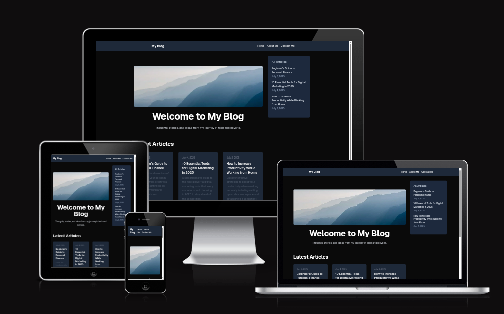

# Blog Project

This is a modern blog application powered by a FastAPI backend, a Next.js frontend, and Notion as a headless CMS. It's designed for easy deployment and scalability, with a focus on clean code and best practices.

## Live Deployment

The application is deployed on Oracle Cloud using Coolify and is accessible at the following URLs:

-   **Frontend:** [https://blog-project.tomdcoding.net/](https://blog-project.tomdcoding.net/)
-   **Backend:** [https://blog-project-be.tomdcoding.net/](https://blog-project-be.tomdcoding.net/)

## Main Features

-   **Dynamic Content Management:** Use Notion as a CMS to create, edit, and manage blog posts.
-   **Responsive Design:** A clean and modern UI built with TailwindCSS that looks great on all devices.
-   **Fast and SEO-friendly:** Server-side rendering with Next.js for optimal performance and SEO.
-   **RESTful API:** A robust backend powered by FastAPI with automatic interactive documentation.
-   **Containerized:** Dockerized for consistent development and easy production deployment.
-   **Contact Form:** A contact form that sends emails to the administrator.
-   **Caching:** Redis is used to cache Notion API responses for faster performance.

## Tech Stack

-   **Backend:** FastAPI, Python 3.12, Uvicorn, Redis
-   **Frontend:** Next.js, React, TailwindCSS
-   **CMS:** Notion API
-   **Deployment:** Docker, Oracle Cloud, Coolify

## Tools Used

-   **Package Management:** `uv` (backend), `npm` (frontend)
-   **API Testing:** `curl`, `httpie`, or any API client.
-   **Code Formatting:** `black` (backend), `prettier` (frontend)
-   **Linting:** `ruff` (backend), `eslint` (frontend)

## Notion Database Setup

To use Notion as a CMS, you'll need to set up a database with the following properties:

| Property Name | Type      | Description                               |
| ------------- | --------- | ----------------------------------------- |
| `title`       | `Title`   | The title of the blog post.               |
| `slug`        | `Text`    | The URL-friendly slug for the post.       |
| `published`   | `Checkbox`| Whether the post is visible to the public.|
| `date`        | `Date`    | The publication date of the post.         |
| `excerpt`     | `Text`    | A short summary of the post.              |
| `tags`        | `Multi-select` | Tags for categorizing the post.      |
| `cover`       | `Files & media` | The cover image for the post.       |

You will also need to create a Notion integration and get an API key.

## Local Deployment

### Prerequisites

-   Python 3.12
-   Node.js 20.x
-   Docker and Docker Compose (recommended)
-   Notion API Key
-   Redis (optional, for caching)

### Running with Docker (Recommended)

1.  **Backend Setup:**
    -   Navigate to the `backend` directory.
    -   Create a `.env` file from the `.env.example` and add your environment variables. See the `backend/README.md` for a full list of environment variables.
    -   Run `docker-compose up -d --build`.

2.  **Frontend Setup:**
    -   Navigate to the `frontend` directory.
    -   Create a `.env.local` file from `.env.local-sample`.
    -   Run `npm install` and then `npm run dev`.

The frontend will be available at `http://localhost:3001` and the backend at `http://localhost:8000`.

### Running without Docker

Follow the instructions in the `backend/README.md` and `frontend/README.md` files for running the applications without Docker.

## API Documentation

Once the backend is running, you can access the interactive API documentation at:

-   **Swagger UI:** [http://localhost:8000/docs](http://localhost:8000/docs)
-   **ReDoc:** [http://localhost:8000/redoc](http://localhost:8000/redoc)
