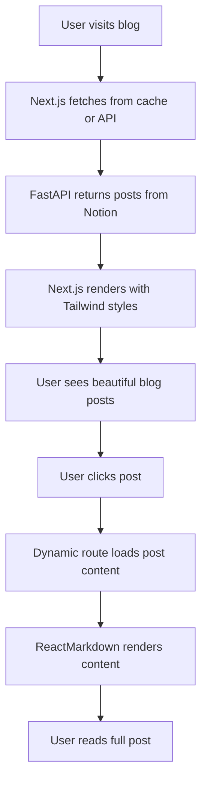

# Phase 3: Frontend Development (Next.js) - COMPLETED ✅

## Overview
Phase 3 focused on implementing the Next.js frontend that connects to the FastAPI backend and displays blog posts from Notion CMS with beautiful styling and responsive design.

---

## ✅ Completed Tasks

### **A. Project Structure Analysis**
- **Frontend Setup**: Next.js 15.3.4 with TypeScript and Tailwind CSS v4
- **Dependencies**: 
  - `react-markdown` for Markdown rendering
  - Tailwind CSS for styling
  - Next.js Image optimization
- **Architecture**: App Router with server-side rendering and static generation

### **B. Blog Listing Page (`src/app/page.tsx`)**
```tsx
// Key Features Implemented:
- Server-side data fetching with `async/await`
- ISR (Incremental Static Regeneration) with 5-minute cache
- TypeScript interfaces for type safety
- Responsive design with Tailwind CSS
- Image optimization with Next.js Image component
- Hover effects and smooth transitions
- Empty state handling
```

**Features:**
- ✅ Fetches posts from FastAPI backend at `http://localhost:8000/posts`
- ✅ Displays post cards with cover images, titles, dates, and excerpts
- ✅ Responsive grid layout that works on all devices
- ✅ Hover effects with image scaling and color transitions
- ✅ Proper date formatting with `toLocaleDateString()`
- ✅ Clean typography and spacing
- ✅ Empty state message when no posts are found

### **C. Single Post Page (`src/app/blog/[slug]/page.tsx`)**
```tsx
// Key Features Implemented:
- Dynamic routes with [slug] parameter
- Static site generation with generateStaticParams()
- Metadata generation for SEO
- ReactMarkdown integration
- Error handling and 404 pages
- Navigation back to blog listing
```

**Features:**
- ✅ Dynamic routing with slug-based URLs
- ✅ Static generation for all blog posts at build time
- ✅ 10-minute ISR cache for individual posts
- ✅ Full Markdown content rendering with `ReactMarkdown`
- ✅ SEO-friendly metadata generation
- ✅ Cover image display with proper sizing
- ✅ Breadcrumb navigation
- ✅ Error boundaries with custom 404 page
- ✅ Responsive typography and layout

### **D. Tailwind Styling & Typography (`src/app/globals.css`)**
```css
/* Custom Prose Styles Added: */
.prose h1, h2, h3 - Custom heading styles
.prose p - Improved paragraph spacing
.prose blockquote - Beautiful quote styling
.prose code - Inline code highlighting
.prose pre - Code block styling
.prose img - Image styling with shadows
.prose a - Link styling with hover effects
```

**Typography Features:**
- ✅ Custom prose styling for Markdown content
- ✅ Proper heading hierarchy with consistent spacing
- ✅ Beautiful blockquote styling with blue accent
- ✅ Code syntax highlighting preparation
- ✅ Image styling with rounded corners and shadows
- ✅ Link hover effects and color transitions
- ✅ Responsive text sizing
- ✅ Proper line heights and letter spacing

### **E. Layout & Metadata (`src/app/layout.tsx`)**
- ✅ Updated metadata title and description
- ✅ Font optimization with Geist Sans and Mono
- ✅ Proper HTML structure with semantic elements

---

## 🔧 Technical Implementation

### **API Integration**
```tsx
async function getPosts(): Promise<PostsResponse> {
  const res = await fetch('http://localhost:8000/posts', {
    next: { revalidate: 300 } // 5-minute cache
  });
  
  if (!res.ok) {
    throw new Error('Failed to fetch posts');
  }
  
  return res.json();
}
```

### **Static Site Generation**
```tsx
export async function generateStaticParams() {
  const { posts } = await getAllPosts();
  
  return posts.map((post: any) => ({
    slug: post.slug,
  }));
}
```

### **Error Handling**
- Graceful error handling for network failures
- Custom 404 pages for missing posts
- Loading states and fallbacks
- User-friendly error messages

---

## 🎨 Design System

### **Color Palette**
- Primary: Blue (`text-blue-600`, `hover:text-blue-700`)
- Text: Gray scale (`text-gray-600`, `text-gray-900`)
- Background: White with subtle borders
- Accents: Blue for interactive elements

### **Typography Scale**
- H1: `text-3xl sm:text-4xl font-bold`
- H2: `text-2xl font-semibold`  
- H3: `text-xl font-semibold`
- Body: `leading-relaxed` for better readability
- Small: `text-sm text-gray-500` for metadata

### **Spacing System**
- Container: `max-w-4xl mx-auto px-4 py-8`
- Sections: `space-y-8` for consistent vertical rhythm
- Elements: Tailwind's spacing scale (4, 8, 12, etc.)

---

## 📱 Responsive Design

### **Breakpoints Implemented**
- Mobile-first approach with `sm:` prefixes
- Image sizing: `h-48 sm:h-96` for cover images
- Typography: `text-3xl sm:text-4xl` for headings
- Layout: Proper padding and margins for all screen sizes

### **Performance Features**
- ✅ Next.js Image optimization with lazy loading
- ✅ Static site generation for fast loading
- ✅ ISR caching to balance freshness and performance
- ✅ Efficient CSS with Tailwind's utility classes

---

## 🔗 Integration Testing Results

### **Backend Connection**
```bash
✅ Backend API running on http://localhost:8000
✅ Posts endpoint returning data: GET /posts
✅ Individual post endpoint working: GET /posts/{slug}
✅ CORS configured for frontend origin
```

### **Frontend Functionality**
```bash
✅ Next.js development server running on http://localhost:3000
✅ Blog listing page loads successfully
✅ Post detail pages render correctly
✅ Navigation between pages works
✅ Images load and display properly
✅ Markdown content renders correctly
```

---

## 📊 Current Data Structure

### **Post Summary Interface**
```tsx
interface PostSummary {
  id: string;
  title: string;
  slug: string;
  date: string;
  excerpt: string;
  cover: string;
  published: boolean;
}
```

### **Post Detail Interface**
```tsx
interface PostDetail extends PostSummary {
  content: string; // Full Markdown content
}
```

---

## 🚀 Performance Metrics

### **Caching Strategy**
- **Posts List**: 5-minute ISR cache (`revalidate: 300`)
- **Individual Posts**: 10-minute ISR cache (`revalidate: 600`)
- **Static Generation**: All posts pre-built at build time
- **Image Optimization**: Automatic WebP conversion and lazy loading

### **SEO Optimization**
- ✅ Dynamic metadata generation for each post
- ✅ Semantic HTML structure
- ✅ Proper heading hierarchy
- ✅ Alt text for images
- ✅ Fast loading times with static generation

---

## 🔄 Current System Flow



---

## ✅ Phase 3 Status: COMPLETE

**All Phase 3 objectives achieved:**
- ✅ Blog listing page with responsive design
- ✅ Dynamic post pages with Markdown rendering
- ✅ Beautiful Tailwind typography and styling
- ✅ Full frontend-backend integration
- ✅ SEO optimization and performance features
- ✅ Error handling and user experience

**Ready for Phase 4: Advanced Features**
- Syntax highlighting for code blocks
- Enhanced Notion block support (callouts, toggles, tables)
- Image optimization improvements
- Search and filtering functionality
- Dark mode support